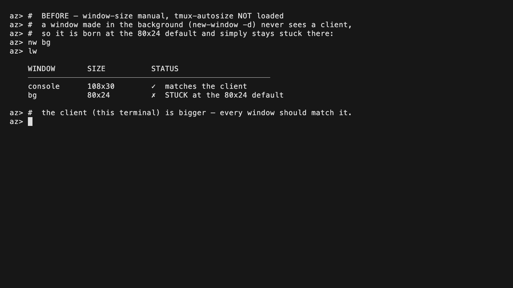
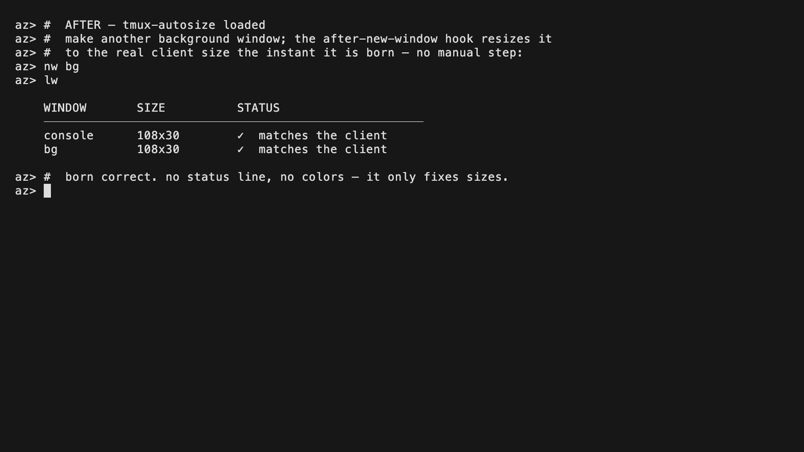
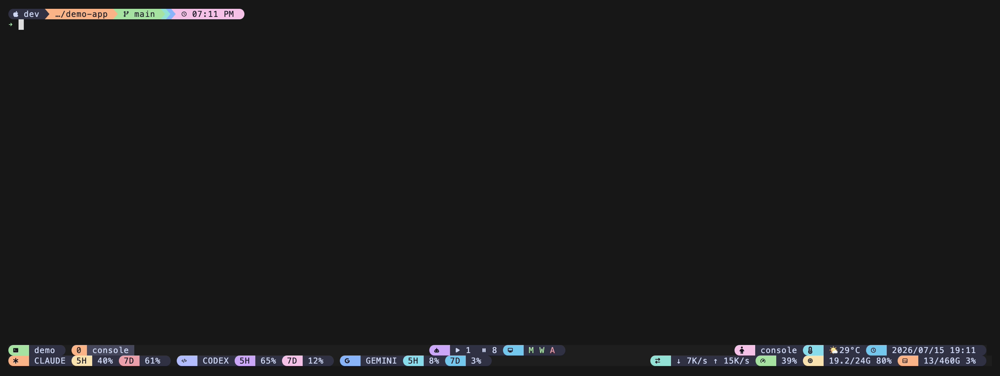

# tmux-autosize

> 中文說明請見 [docs/zh.md](docs/zh.md)

**Stops tmux windows from getting stuck at `80x24` (or some other stale size).
Four hooks quietly converge each window to the size of the client that's
actually looking at it.**



*Before — under `window-size manual`, a window made in the background (`new-window -d`) is born stuck at `80x24`.*



*After — tmux-autosize converges the same window to the client's real size on its own, the moment it is created.*

## What is this?

Every so often tmux leaves a window at the wrong size — most famously the tiny
`80x24` default — and it just *stays* there until you do something to jog it.
It happens in a handful of ordinary situations:

- **Windows created in the background** (`new-window -d`, or a script/agent that
  spawns windows) never see a client, so they're born at the default size and
  stay there.
- **`window-size manual` users** — the moment you turn off tmux's automatic
  sizing, inactive windows keep whatever size they last had and don't follow the
  client.
- **A terminal that attaches before it reaches its final size** (tiling window
  managers, restored sessions, slow SSH) can leave the window a step behind.
- **The middle of a drag-resize**, where tmux briefly sees intermediate sizes.

tmux-autosize installs four hooks — on attach, on resize, on switching windows,
and on creating a window — that each resize the affected window to the current
client's real width and height with an explicit `resize-window -x -y`. A fifth
hook completes a resize that had to be postponed while you were scrolling (see
the copy-mode note below). No status line, no tokens, no colors — it only fixes
sizes.

> **Honest positioning.** If you use tmux's default **`window-size latest`**,
> tmux already resizes the active window to the latest client on its own, so for
> you this plugin is mostly a **safety fuse** — it catches the leftover cases
> (background/scripted windows, a second client attaching, an attach that
> happened before the terminal settled). If you use **`window-size manual`**
> (common once you script windows or run multiple clients), tmux deliberately
> stops auto-sizing and this plugin becomes **the thing that keeps your windows
> the right size**. The copy-mode guard is a conservative defence against
> resize-triggered scrollback re-wrapping — the cost class documented upstream in
> [tmux/tmux#4814](https://github.com/tmux/tmux/issues/4814) (a drag-resize +
> very-large-history freeze; not copy-mode-specific, hence "conservative"). It shares the
> `@`-option vocabulary of the rest of this plugin family but has **zero
> dependency** on any of them.

## Quickstart

New to tmux's `prefix` key? The default prefix is `Ctrl-b` — press `Ctrl-b`,
release it, then press the next key. (You only need this for `prefix + I`
below.)

You need **tmux 3.0 or newer** (see [Requirements](#requirements)). Pick one of
the two install paths, then reload.

### 1. Install the plugin

#### Path A — with TPM (the tmux plugin manager)

If you've never installed TPM, run these three lines first (copy-paste as-is):

```sh
git clone https://github.com/tmux-plugins/tpm ~/.tmux/plugins/tpm
printf '\n%s\n' "run '~/.tmux/plugins/tpm/tpm'" >> ~/.tmux.conf
tmux source ~/.tmux.conf
```

(If tmux isn't running yet, `tmux source` may print "no server running" —
that's fine, it takes effect next time you start tmux.)

Then add tmux-autosize. Put this line in your `~/.tmux.conf` **above** the
`run '~/.tmux/plugins/tpm/tpm'` line:

```tmux
set -g @plugin 'operonlab/tmux-autosize'
```

#### Path B — without TPM (one line, no plugin manager)

Clone it anywhere, then add one line to `~/.tmux.conf`:

```sh
git clone https://github.com/operonlab/tmux-autosize ~/.tmux/plugins/tmux-autosize
printf '%s\n' "run-shell '~/.tmux/plugins/tmux-autosize/autosize.tmux'" >> ~/.tmux.conf
```

### 2. (Optional) Set any options

All options have sensible defaults, so you can skip this. If you want to change
one, put it in `~/.tmux.conf` **before** the plugin line — see
[Options](#options).

### 3. Reload (and, with TPM, install)

```sh
tmux source ~/.tmux.conf   # reload config
```

With **TPM**, also press `prefix + I` (capital i) once to fetch the plugin.

That's it. From now on your windows converge to the right size on their own.

## Demo



## Options

Set any of these in `~/.tmux.conf` **before** the plugin line. All are optional.

| Option | Default | What it does (plain words) |
|---|---|---|
| `@autosize-debounce-ms` | `250` | How long (milliseconds) a resize burst must go quiet before the window is converged. Bigger = calmer during a drag; smaller = snappier. |
| `@autosize-on-attach` | `on` | Converge the current window when a client attaches. |
| `@autosize-on-new-window` | `on` | Converge a freshly created window (this is what fixes background `new-window -d`). |
| `@autosize-on-select-window` | `on` | Converge a window when you switch to it (matters under `window-size manual`). |
| `@autosize-copy-mode-safe` | `on` | While a pane is in copy-mode, postpone its resize (and finish it when you leave) instead of paying the scrollback re-wrap cost at the worst moment. Turn off only if you know you want immediate resizes. |
| `@autosize-rebalance` | `off` | After a window converges, optionally re-arrange its panes. `off` leaves them to tmux's own proportional scaling; `spread` evens them out *without* changing the layout shape (`select-layout -E`); `even-horizontal` / `even-vertical` / `tiled` apply that named tmux layout. Any other value is ignored. See the pane-proportions FAQ. |
| `@autosize-debug` | `off` | Write a one-line-per-action log to the runtime dir (see the last FAQ entry). Handy for reporting a bug. |

> **`@autosize-rebalance` version note.** `spread` uses `select-layout -E`, which
> the official [tmux CHANGES](https://github.com/tmux/tmux/blob/master/CHANGES)
> added under **"CHANGES FROM 2.6 TO 2.7"** (*"Add select-layout -E to spread
> panes out evenly"*). The `even-horizontal` / `even-vertical` / `tiled` layouts
> are older still. All are below this plugin's own **tmux 3.0** floor, so
> `@autosize-rebalance` needs nothing newer than the plugin already requires.

Setting any option to a value other than `on` disables that hook. To turn one
off explicitly:

> **Note:** options are read when the plugin loads. On an already-running
> server, changing them takes effect after running `scripts/teardown.sh` and
> re-sourcing your config (or restarting tmux) — a plain reload does not rewire
> hooks that are already installed.

```tmux
set -g @autosize-on-attach 'off'
```

## Uninstall

Run the bundled teardown script (detaches only the hooks this plugin added and
clears its runtime dir), then delete the folder:

```sh
~/.tmux/plugins/tmux-autosize/scripts/teardown.sh
rm -rf ~/.tmux/plugins/tmux-autosize
```

(If you installed via TPM, also remove the
`set -g @plugin '.../tmux-autosize'` line from `~/.tmux.conf`.)

Teardown removes **only** the hook array elements this plugin installed — any
hooks you or another plugin set on the same events are left in place.

## Troubleshooting / FAQ

**Will this fight with tmux's own resizing?**
No. On `window-size latest` tmux already keeps the *active* window matched to the
latest client, so the plugin's resize is a no-op there and simply covers the
windows tmux doesn't touch (background, inactive-under-manual, second client).
Resizing a window that is already the right size does nothing.

**Why does a resize wait while I'm scrolling or in copy-mode?**
Because resizing forces tmux to re-wrap the pane's scrollback, and with a very
large history that re-wrap is expensive — upstream
[tmux/tmux#4814](https://github.com/tmux/tmux/issues/4814) documents a freeze of
this class (drag-resize + huge history). Copy-mode is exactly when you are
actively using that scrollback, so the plugin plays it safe. With
`@autosize-copy-mode-safe on` (the default) the plugin records the wanted size
and applies it the instant you leave copy-mode, so you still end up at the right
size — just a moment later. Set the option to `off` to resize immediately if you
never hit the bug.

**It didn't resize a detached/background session that has no client — why?**
By design. The plugin converges a window to the size of the *client looking at
it*; with no client attached there's no size to converge to, so it does nothing
rather than guess. Attach a client and the size follows.

**Do my pane proportions change after a resize?**
By default, **no** — the plugin only changes the **window** size, and tmux itself
scales the panes *proportionally* to the new size (a pane that was half the width
stays about half). It does not run `select-layout`.

If you *want* the panes re-arranged on each convergence, set
`@autosize-rebalance`:

- `spread` — even the panes out *without* changing the layout shape
  (`select-layout -E`).
- `even-horizontal` / `even-vertical` / `tiled` — apply that named tmux layout.

Unlike the on/off hook toggles, `@autosize-rebalance` is read *fresh on every
convergence*, so a change takes effect on the **next** resize with no
teardown/reload needed — the running-server caveat in the
[Options](#options) note applies to the hook-install toggles, not to this one.

**How do I see what it's doing?**
Turn on the debug log:

```tmux
set -g @autosize-debug 'on'
```

then reload and watch:

```sh
tail -f "${TMUX_TMPDIR:-/tmp}/tmux-autosize-$(id -u)/autosize.log"
```

Each line records a `resize:`, a `defer:` (copy-mode), or a `flush resize:`.

## Requirements

- **tmux 3.0 or newer.** This floor is verified against the primary source, not
  guessed. The plugin installs its hooks by **appending to hook array options**
  (`set-hook -ga <hook>` / `<hook>[N]` index syntax). Hooks only *became* array
  options in tmux 3.0 — the official
  [tmux CHANGES](https://github.com/tmux/tmux/blob/master/CHANGES) says so under
  **"CHANGES FROM 2.9 TO 3.0"**: *"Hooks are now stored in the options tree as
  array options, allowing them to have multiple separate commands."* On tmux 2.9
  or older, appending would overwrite a user's existing hook, so the plugin is
  not supported there.
- **Tested on:** tmux `next-3.8` (development build) on macOS, and against the
  tmux shipped by `ubuntu-latest` in CI (currently 3.x). The headless functional
  suite runs on both.
- **No runtime dependencies** beyond tmux and a POSIX shell — only `awk`, `grep`,
  `date`, `stat` and friends, all already present on macOS and Linux. The
  debounce timer uses an identity token rather than sub-second timestamps, so it
  works even where `date +%N` is unavailable (stock BSD/macOS).

## Credits / License

The resize approach — explicit `-x/-y` convergence, per-client size, the
copy-mode defer/flush pair that sidesteps the resize-reflow cost class
documented in [tmux/tmux#4814](https://github.com/tmux/tmux/issues/4814), and the
`TARGET_WIN` pin for background `new-window -d` — is the generic core extracted
from the author's private tmux resize toolchain. Released under the
[MIT License](LICENSE).
